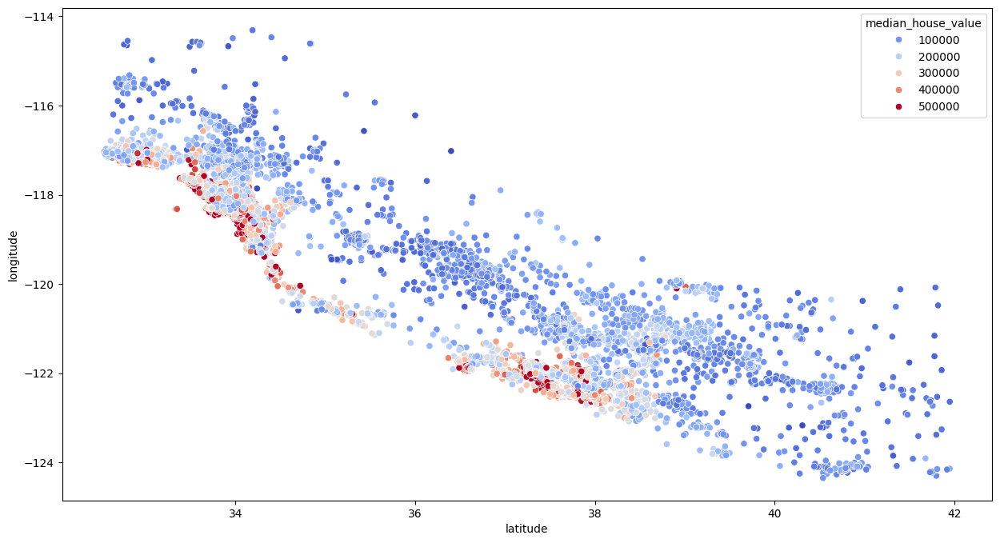

# Housing Price Prediction Model

## Overview
In this project, I developed a machine learning model to predict housing prices. Utilizing a dataset of various housing attributes, the model's goal is to accurately estimate the median house value based on features such as location, number of rooms, etc.

In the end my random forest model was able to predict the accuracy of the housing prices by around 
**81%**

## Key Components

### Data Preprocessing
In preprocessing, I cleaned, normalizad, and feature engineered to prepare the data for model training.
For example, I
- eliminated rows with any null values with the .dropna() method
- seperated dataset into train and test X, Y datasets
- studing the correlation between all the fields in the training data dataset to feature engineer meaningful new fieatures in the dataset
-perfomed natural logarithms on some fields of the trainign dataset in order to create normal distribution
- derive one-hot-encoded data from categorical data
### Model Selection
I chose the 'LinearRegression' and `RandomForestRegressor` from scikit-learn

### Results
Running LinearRegression().score() gave me 0.68747
Running RandomForestRegressor().score() gave me ~0.8175
Clearly, the random forest model worked better

### Hyperparameter Tuning
I tried to perform hyperparameter tuning using `GridSearchCV`. Explored different combinations of `n_estimators` and `max_features` to optimize the model's performance.


## Tools and Libraries Used
- **Python**: Primary programming language
- **Pandas**: Data manipulation and analysis
- **Scikit-learn**: Machine learning library
- **JupyterLab**: Development environment


```python
import pandas as pd
import numpy as np
import matplotlib.pyplot as plt
import seaborn as sns
```

    C:\Users\tahai\AppData\Local\Temp\ipykernel_15100\555797462.py:1: DeprecationWarning: 
    Pyarrow will become a required dependency of pandas in the next major release of pandas (pandas 3.0),
    (to allow more performant data types, such as the Arrow string type, and better interoperability with other libraries)
    but was not found to be installed on your system.
    If this would cause problems for you,
    please provide us feedback at https://github.com/pandas-dev/pandas/issues/54466
            
      import pandas as pd
    


```python
data = pd.read_csv("housing.csv")  # read csv data and store it into a dataframe
```


```python
data.info() # provides a concise summary of a dataframe. We can see that there are some null values in the total bedrooms column. Since there arent that many null values, we will just drop the rows containing them

```

    <class 'pandas.core.frame.DataFrame'>
    RangeIndex: 20640 entries, 0 to 20639
    Data columns (total 10 columns):
     #   Column              Non-Null Count  Dtype  
    ---  ------              --------------  -----  
     0   longitude           20640 non-null  float64
     1   latitude            20640 non-null  float64
     2   housing_median_age  20640 non-null  float64
     3   total_rooms         20640 non-null  float64
     4   total_bedrooms      20433 non-null  float64
     5   population          20640 non-null  float64
     6   households          20640 non-null  float64
     7   median_income       20640 non-null  float64
     8   median_house_value  20640 non-null  float64
     9   ocean_proximity     20640 non-null  object 
    dtypes: float64(9), object(1)
    memory usage: 1.6+ MB
    


```python
data.dropna(inplace=True) #drop any rows in the dataframe with even one null value. Modifies inplace
```


```python
data.info() #now we can see that the null values are gone
```

    <class 'pandas.core.frame.DataFrame'>
    Index: 20433 entries, 0 to 20639
    Data columns (total 10 columns):
     #   Column              Non-Null Count  Dtype  
    ---  ------              --------------  -----  
     0   longitude           20433 non-null  float64
     1   latitude            20433 non-null  float64
     2   housing_median_age  20433 non-null  float64
     3   total_rooms         20433 non-null  float64
     4   total_bedrooms      20433 non-null  float64
     5   population          20433 non-null  float64
     6   households          20433 non-null  float64
     7   median_income       20433 non-null  float64
     8   median_house_value  20433 non-null  float64
     9   ocean_proximity     20433 non-null  object 
    dtypes: float64(9), object(1)
    memory usage: 1.7+ MB
    


```python
from sklearn.model_selection import train_test_split

X = data.drop(['median_house_value'], axis = 1) #All the values except 'median_house_value' are what we are goign to train on
y = data['median_house_value']  # 'median_house_value' is what we want to predict using machine learning
```


```python
X_train, X_test, y_train, y_test = train_test_split(X, y, test_size=0.2) # Create seperate train and test datasets
```


```python
train_data = X_train.join(y_train) # Create a complete training dataset. Combines based on common indices
```


```python
train_data
```


<div>
<style scoped>
    .dataframe tbody tr th:only-of-type {
        vertical-align: middle;
    }

    .dataframe tbody tr th {
        vertical-align: top;
    }

    .dataframe thead th {
        text-align: right;
    }
</style>
<table border="1" class="dataframe">
  <thead>
    <tr style="text-align: right;">
      <th></th>
      <th>longitude</th>
      <th>latitude</th>
      <th>housing_median_age</th>
      <th>total_rooms</th>
      <th>total_bedrooms</th>
      <th>population</th>
      <th>households</th>
      <th>median_income</th>
      <th>ocean_proximity</th>
      <th>median_house_value</th>
    </tr>
  </thead>
  <tbody>
    <tr>
      <th>12390</th>
      <td>-116.44</td>
      <td>33.74</td>
      <td>5.0</td>
      <td>846.0</td>
      <td>249.0</td>
      <td>117.0</td>
      <td>67.0</td>
      <td>7.9885</td>
      <td>INLAND</td>
      <td>403300.0</td>
    </tr>
    <tr>
      <th>11214</th>
      <td>-117.91</td>
      <td>33.82</td>
      <td>32.0</td>
      <td>1408.0</td>
      <td>307.0</td>
      <td>1331.0</td>
      <td>284.0</td>
      <td>3.7014</td>
      <td>&lt;1H OCEAN</td>
      <td>179600.0</td>
    </tr>
    <tr>
      <th>3971</th>
      <td>-118.58</td>
      <td>34.19</td>
      <td>35.0</td>
      <td>2329.0</td>
      <td>399.0</td>
      <td>966.0</td>
      <td>336.0</td>
      <td>3.8839</td>
      <td>&lt;1H OCEAN</td>
      <td>224900.0</td>
    </tr>
    <tr>
      <th>13358</th>
      <td>-117.61</td>
      <td>34.04</td>
      <td>8.0</td>
      <td>4116.0</td>
      <td>766.0</td>
      <td>1785.0</td>
      <td>745.0</td>
      <td>3.1672</td>
      <td>INLAND</td>
      <td>150200.0</td>
    </tr>
    <tr>
      <th>988</th>
      <td>-121.86</td>
      <td>37.70</td>
      <td>13.0</td>
      <td>9621.0</td>
      <td>1344.0</td>
      <td>4389.0</td>
      <td>1391.0</td>
      <td>6.6827</td>
      <td>INLAND</td>
      <td>313700.0</td>
    </tr>
    <tr>
      <th>...</th>
      <td>...</td>
      <td>...</td>
      <td>...</td>
      <td>...</td>
      <td>...</td>
      <td>...</td>
      <td>...</td>
      <td>...</td>
      <td>...</td>
      <td>...</td>
    </tr>
    <tr>
      <th>3662</th>
      <td>-118.38</td>
      <td>34.25</td>
      <td>38.0</td>
      <td>983.0</td>
      <td>185.0</td>
      <td>513.0</td>
      <td>170.0</td>
      <td>4.8816</td>
      <td>&lt;1H OCEAN</td>
      <td>231500.0</td>
    </tr>
    <tr>
      <th>14732</th>
      <td>-117.02</td>
      <td>32.81</td>
      <td>26.0</td>
      <td>1998.0</td>
      <td>301.0</td>
      <td>874.0</td>
      <td>305.0</td>
      <td>5.4544</td>
      <td>&lt;1H OCEAN</td>
      <td>180900.0</td>
    </tr>
    <tr>
      <th>16058</th>
      <td>-122.49</td>
      <td>37.76</td>
      <td>52.0</td>
      <td>1792.0</td>
      <td>305.0</td>
      <td>782.0</td>
      <td>287.0</td>
      <td>4.0391</td>
      <td>NEAR BAY</td>
      <td>332700.0</td>
    </tr>
    <tr>
      <th>6707</th>
      <td>-118.15</td>
      <td>34.14</td>
      <td>27.0</td>
      <td>1499.0</td>
      <td>426.0</td>
      <td>755.0</td>
      <td>414.0</td>
      <td>3.8750</td>
      <td>&lt;1H OCEAN</td>
      <td>258300.0</td>
    </tr>
    <tr>
      <th>13764</th>
      <td>-117.13</td>
      <td>34.06</td>
      <td>4.0</td>
      <td>3078.0</td>
      <td>510.0</td>
      <td>1341.0</td>
      <td>486.0</td>
      <td>4.9688</td>
      <td>INLAND</td>
      <td>163200.0</td>
    </tr>
  </tbody>
</table>
<p>16346 rows × 10 columns</p>
</div>


```python
train_data.hist()
```


    array([[<Axes: title={'center': 'longitude'}>,
            <Axes: title={'center': 'latitude'}>,
            <Axes: title={'center': 'housing_median_age'}>],
           [<Axes: title={'center': 'total_rooms'}>,
            <Axes: title={'center': 'total_bedrooms'}>,
            <Axes: title={'center': 'population'}>],
           [<Axes: title={'center': 'households'}>,
            <Axes: title={'center': 'median_income'}>,
            <Axes: title={'center': 'median_house_value'}>]], dtype=object)


    

    


```python
numeric_data = train_data.select_dtypes(include=[np.number]) # Creating a new dataset 'numeric_data' with only the numeric datatypes
corr_matrix = numeric_data.corr() # A matrix with all correlation values between all pars of numeric fields
```


```python
corr_matrix
```


<div>
<style scoped>
    .dataframe tbody tr th:only-of-type {
        vertical-align: middle;
    }

    .dataframe tbody tr th {
        vertical-align: top;
    }

    .dataframe thead th {
        text-align: right;
    }
</style>
<table border="1" class="dataframe">
  <thead>
    <tr style="text-align: right;">
      <th></th>
      <th>longitude</th>
      <th>latitude</th>
      <th>housing_median_age</th>
      <th>total_rooms</th>
      <th>total_bedrooms</th>
      <th>population</th>
      <th>households</th>
      <th>median_income</th>
      <th>median_house_value</th>
    </tr>
  </thead>
  <tbody>
    <tr>
      <th>longitude</th>
      <td>1.000000</td>
      <td>-0.924710</td>
      <td>-0.103642</td>
      <td>0.044318</td>
      <td>0.069334</td>
      <td>0.097529</td>
      <td>0.054852</td>
      <td>-0.016018</td>
      <td>-0.043630</td>
    </tr>
    <tr>
      <th>latitude</th>
      <td>-0.924710</td>
      <td>1.000000</td>
      <td>0.007825</td>
      <td>-0.035261</td>
      <td>-0.065960</td>
      <td>-0.106548</td>
      <td>-0.069899</td>
      <td>-0.078715</td>
      <td>-0.145993</td>
    </tr>
    <tr>
      <th>housing_median_age</th>
      <td>-0.103642</td>
      <td>0.007825</td>
      <td>1.000000</td>
      <td>-0.362495</td>
      <td>-0.324781</td>
      <td>-0.301916</td>
      <td>-0.306993</td>
      <td>-0.124138</td>
      <td>0.100925</td>
    </tr>
    <tr>
      <th>total_rooms</th>
      <td>0.044318</td>
      <td>-0.035261</td>
      <td>-0.362495</td>
      <td>1.000000</td>
      <td>0.931237</td>
      <td>0.864408</td>
      <td>0.919232</td>
      <td>0.199789</td>
      <td>0.132022</td>
    </tr>
    <tr>
      <th>total_bedrooms</th>
      <td>0.069334</td>
      <td>-0.065960</td>
      <td>-0.324781</td>
      <td>0.931237</td>
      <td>1.000000</td>
      <td>0.885152</td>
      <td>0.978566</td>
      <td>-0.004929</td>
      <td>0.048961</td>
    </tr>
    <tr>
      <th>population</th>
      <td>0.097529</td>
      <td>-0.106548</td>
      <td>-0.301916</td>
      <td>0.864408</td>
      <td>0.885152</td>
      <td>1.000000</td>
      <td>0.915534</td>
      <td>0.010363</td>
      <td>-0.025150</td>
    </tr>
    <tr>
      <th>households</th>
      <td>0.054852</td>
      <td>-0.069899</td>
      <td>-0.306993</td>
      <td>0.919232</td>
      <td>0.978566</td>
      <td>0.915534</td>
      <td>1.000000</td>
      <td>0.016691</td>
      <td>0.064427</td>
    </tr>
    <tr>
      <th>median_income</th>
      <td>-0.016018</td>
      <td>-0.078715</td>
      <td>-0.124138</td>
      <td>0.199789</td>
      <td>-0.004929</td>
      <td>0.010363</td>
      <td>0.016691</td>
      <td>1.000000</td>
      <td>0.686716</td>
    </tr>
    <tr>
      <th>median_house_value</th>
      <td>-0.043630</td>
      <td>-0.145993</td>
      <td>0.100925</td>
      <td>0.132022</td>
      <td>0.048961</td>
      <td>-0.025150</td>
      <td>0.064427</td>
      <td>0.686716</td>
      <td>1.000000</td>
    </tr>
  </tbody>
</table>
</div>


```python
plt.figure(figsize=(15,8))
sns.heatmap(corr_matrix, annot=True,cmap= "YlGnBu") #Creating a figure with the correlation values
```


    <Axes: >


    

    


```python
# A lot of the data in certain fields has skewed distributions. This is not ideal for training an ML model. So we take the natural logarithm of all values in these colummns. This preserves corraltion but creates a normal distribution.
train_data['total_rooms'] = np.log(train_data['total_rooms'] + 1)
train_data['total_bedrooms'] = np.log(train_data['total_bedrooms'] + 1)
train_data['population'] = np.log(train_data['population'] + 1)
train_data['households'] = np.log(train_data['households'] + 1)
```


```python
train_data.hist(figsize=(15,8))  #now we can see the normal distributions in a histogram
```


    array([[<Axes: title={'center': 'longitude'}>,
            <Axes: title={'center': 'latitude'}>,
            <Axes: title={'center': 'housing_median_age'}>],
           [<Axes: title={'center': 'total_rooms'}>,
            <Axes: title={'center': 'total_bedrooms'}>,
            <Axes: title={'center': 'population'}>],
           [<Axes: title={'center': 'households'}>,
            <Axes: title={'center': 'median_income'}>,
            <Axes: title={'center': 'median_house_value'}>]], dtype=object)


    

    


```python
dummies = pd.get_dummies(train_data.ocean_proximity)
```


```python
one_hot_encoded = dummies.astype(int)#Ocean_proximity is categorical data. We now create one_hot_encoded values from this data.
train_data = train_data.join(one_hot_encoded).drop(['ocean_proximity'], axis = 1) #join the one-hot-encoded dataset with the train_data and drop the ocea-proximity encoded data
```


```python
train_data
```


<div>
<style scoped>
    .dataframe tbody tr th:only-of-type {
        vertical-align: middle;
    }

    .dataframe tbody tr th {
        vertical-align: top;
    }

    .dataframe thead th {
        text-align: right;
    }
</style>
<table border="1" class="dataframe">
  <thead>
    <tr style="text-align: right;">
      <th></th>
      <th>longitude</th>
      <th>latitude</th>
      <th>housing_median_age</th>
      <th>total_rooms</th>
      <th>total_bedrooms</th>
      <th>population</th>
      <th>households</th>
      <th>median_income</th>
      <th>median_house_value</th>
      <th>&lt;1H OCEAN</th>
      <th>INLAND</th>
      <th>ISLAND</th>
      <th>NEAR BAY</th>
      <th>NEAR OCEAN</th>
    </tr>
  </thead>
  <tbody>
    <tr>
      <th>12390</th>
      <td>-116.44</td>
      <td>33.74</td>
      <td>5.0</td>
      <td>6.741701</td>
      <td>5.521461</td>
      <td>4.770685</td>
      <td>4.219508</td>
      <td>7.9885</td>
      <td>403300.0</td>
      <td>0</td>
      <td>1</td>
      <td>0</td>
      <td>0</td>
      <td>0</td>
    </tr>
    <tr>
      <th>11214</th>
      <td>-117.91</td>
      <td>33.82</td>
      <td>32.0</td>
      <td>7.250636</td>
      <td>5.730100</td>
      <td>7.194437</td>
      <td>5.652489</td>
      <td>3.7014</td>
      <td>179600.0</td>
      <td>1</td>
      <td>0</td>
      <td>0</td>
      <td>0</td>
      <td>0</td>
    </tr>
    <tr>
      <th>3971</th>
      <td>-118.58</td>
      <td>34.19</td>
      <td>35.0</td>
      <td>7.753624</td>
      <td>5.991465</td>
      <td>6.874198</td>
      <td>5.820083</td>
      <td>3.8839</td>
      <td>224900.0</td>
      <td>1</td>
      <td>0</td>
      <td>0</td>
      <td>0</td>
      <td>0</td>
    </tr>
    <tr>
      <th>13358</th>
      <td>-117.61</td>
      <td>34.04</td>
      <td>8.0</td>
      <td>8.322880</td>
      <td>6.642487</td>
      <td>7.487734</td>
      <td>6.614726</td>
      <td>3.1672</td>
      <td>150200.0</td>
      <td>0</td>
      <td>1</td>
      <td>0</td>
      <td>0</td>
      <td>0</td>
    </tr>
    <tr>
      <th>988</th>
      <td>-121.86</td>
      <td>37.70</td>
      <td>13.0</td>
      <td>9.171807</td>
      <td>7.204149</td>
      <td>8.387085</td>
      <td>7.238497</td>
      <td>6.6827</td>
      <td>313700.0</td>
      <td>0</td>
      <td>1</td>
      <td>0</td>
      <td>0</td>
      <td>0</td>
    </tr>
    <tr>
      <th>...</th>
      <td>...</td>
      <td>...</td>
      <td>...</td>
      <td>...</td>
      <td>...</td>
      <td>...</td>
      <td>...</td>
      <td>...</td>
      <td>...</td>
      <td>...</td>
      <td>...</td>
      <td>...</td>
      <td>...</td>
      <td>...</td>
    </tr>
    <tr>
      <th>3662</th>
      <td>-118.38</td>
      <td>34.25</td>
      <td>38.0</td>
      <td>6.891626</td>
      <td>5.225747</td>
      <td>6.242223</td>
      <td>5.141664</td>
      <td>4.8816</td>
      <td>231500.0</td>
      <td>1</td>
      <td>0</td>
      <td>0</td>
      <td>0</td>
      <td>0</td>
    </tr>
    <tr>
      <th>14732</th>
      <td>-117.02</td>
      <td>32.81</td>
      <td>26.0</td>
      <td>7.600402</td>
      <td>5.710427</td>
      <td>6.774224</td>
      <td>5.723585</td>
      <td>5.4544</td>
      <td>180900.0</td>
      <td>1</td>
      <td>0</td>
      <td>0</td>
      <td>0</td>
      <td>0</td>
    </tr>
    <tr>
      <th>16058</th>
      <td>-122.49</td>
      <td>37.76</td>
      <td>52.0</td>
      <td>7.491645</td>
      <td>5.723585</td>
      <td>6.663133</td>
      <td>5.662960</td>
      <td>4.0391</td>
      <td>332700.0</td>
      <td>0</td>
      <td>0</td>
      <td>0</td>
      <td>1</td>
      <td>0</td>
    </tr>
    <tr>
      <th>6707</th>
      <td>-118.15</td>
      <td>34.14</td>
      <td>27.0</td>
      <td>7.313220</td>
      <td>6.056784</td>
      <td>6.628041</td>
      <td>6.028279</td>
      <td>3.8750</td>
      <td>258300.0</td>
      <td>1</td>
      <td>0</td>
      <td>0</td>
      <td>0</td>
      <td>0</td>
    </tr>
    <tr>
      <th>13764</th>
      <td>-117.13</td>
      <td>34.06</td>
      <td>4.0</td>
      <td>8.032360</td>
      <td>6.236370</td>
      <td>7.201916</td>
      <td>6.188264</td>
      <td>4.9688</td>
      <td>163200.0</td>
      <td>0</td>
      <td>1</td>
      <td>0</td>
      <td>0</td>
      <td>0</td>
    </tr>
  </tbody>
</table>
<p>16346 rows × 14 columns</p>
</div>


```python
plt.figure(figsize=(15,8))
sns.heatmap(train_data.corr(), annot=True,cmap= "YlGnBu")
```


    <Axes: >


    

    


```python
plt.figure(figsize=(15,8))
sns.scatterplot(x="latitude", y="longitude", data=train_data, hue="median_house_value", palette="coolwarm") #create this cool little figure that maps latitide and longitude of certain neightborhods and, among them, highlights the neighborhoods with high prices
```


    <Axes: xlabel='latitude', ylabel='longitude'>


    

    


```python
train_data['bedroom_ratio'] = train_data['total_bedrooms'] / train_data['total_rooms'] #We add a field to train_data called bedroom ratio. How many bedrooms are there for every room in the neighborhood
train_data['household_rooms'] = train_data['total_rooms'] / train_data['households'] #How many rooms are ther per houshold?
```


```python
plt.figure(figsize=(15,8))
sns.heatmap(train_data.corr(), annot=True,cmap= "YlGnBu")
```


    <Axes: >


    

    


```python

```


```python

```


```python
from sklearn.linear_model import LinearRegression

X_train, y_train  = train_data.drop(['median_house_value'], axis = 1), train_data['median_house_value']

reg = LinearRegression()

reg.fit(X_train, y_train)
```


<style>#sk-container-id-1 {color: black;}#sk-container-id-1 pre{padding: 0;}#sk-container-id-1 div.sk-toggleable {background-color: white;}#sk-container-id-1 label.sk-toggleable__label {cursor: pointer;display: block;width: 100%;margin-bottom: 0;padding: 0.3em;box-sizing: border-box;text-align: center;}#sk-container-id-1 label.sk-toggleable__label-arrow:before {content: "▸";float: left;margin-right: 0.25em;color: #696969;}#sk-container-id-1 label.sk-toggleable__label-arrow:hover:before {color: black;}#sk-container-id-1 div.sk-estimator:hover label.sk-toggleable__label-arrow:before {color: black;}#sk-container-id-1 div.sk-toggleable__content {max-height: 0;max-width: 0;overflow: hidden;text-align: left;background-color: #f0f8ff;}#sk-container-id-1 div.sk-toggleable__content pre {margin: 0.2em;color: black;border-radius: 0.25em;background-color: #f0f8ff;}#sk-container-id-1 input.sk-toggleable__control:checked~div.sk-toggleable__content {max-height: 200px;max-width: 100%;overflow: auto;}#sk-container-id-1 input.sk-toggleable__control:checked~label.sk-toggleable__label-arrow:before {content: "▾";}#sk-container-id-1 div.sk-estimator input.sk-toggleable__control:checked~label.sk-toggleable__label {background-color: #d4ebff;}#sk-container-id-1 div.sk-label input.sk-toggleable__control:checked~label.sk-toggleable__label {background-color: #d4ebff;}#sk-container-id-1 input.sk-hidden--visually {border: 0;clip: rect(1px 1px 1px 1px);clip: rect(1px, 1px, 1px, 1px);height: 1px;margin: -1px;overflow: hidden;padding: 0;position: absolute;width: 1px;}#sk-container-id-1 div.sk-estimator {font-family: monospace;background-color: #f0f8ff;border: 1px dotted black;border-radius: 0.25em;box-sizing: border-box;margin-bottom: 0.5em;}#sk-container-id-1 div.sk-estimator:hover {background-color: #d4ebff;}#sk-container-id-1 div.sk-parallel-item::after {content: "";width: 100%;border-bottom: 1px solid gray;flex-grow: 1;}#sk-container-id-1 div.sk-label:hover label.sk-toggleable__label {background-color: #d4ebff;}#sk-container-id-1 div.sk-serial::before {content: "";position: absolute;border-left: 1px solid gray;box-sizing: border-box;top: 0;bottom: 0;left: 50%;z-index: 0;}#sk-container-id-1 div.sk-serial {display: flex;flex-direction: column;align-items: center;background-color: white;padding-right: 0.2em;padding-left: 0.2em;position: relative;}#sk-container-id-1 div.sk-item {position: relative;z-index: 1;}#sk-container-id-1 div.sk-parallel {display: flex;align-items: stretch;justify-content: center;background-color: white;position: relative;}#sk-container-id-1 div.sk-item::before, #sk-container-id-1 div.sk-parallel-item::before {content: "";position: absolute;border-left: 1px solid gray;box-sizing: border-box;top: 0;bottom: 0;left: 50%;z-index: -1;}#sk-container-id-1 div.sk-parallel-item {display: flex;flex-direction: column;z-index: 1;position: relative;background-color: white;}#sk-container-id-1 div.sk-parallel-item:first-child::after {align-self: flex-end;width: 50%;}#sk-container-id-1 div.sk-parallel-item:last-child::after {align-self: flex-start;width: 50%;}#sk-container-id-1 div.sk-parallel-item:only-child::after {width: 0;}#sk-container-id-1 div.sk-dashed-wrapped {border: 1px dashed gray;margin: 0 0.4em 0.5em 0.4em;box-sizing: border-box;padding-bottom: 0.4em;background-color: white;}#sk-container-id-1 div.sk-label label {font-family: monospace;font-weight: bold;display: inline-block;line-height: 1.2em;}#sk-container-id-1 div.sk-label-container {text-align: center;}#sk-container-id-1 div.sk-container {/* jupyter's `normalize.less` sets `[hidden] { display: none; }` but bootstrap.min.css set `[hidden] { display: none !important; }` so we also need the `!important` here to be able to override the default hidden behavior on the sphinx rendered scikit-learn.org. See: https://github.com/scikit-learn/scikit-learn/issues/21755 */display: inline-block !important;position: relative;}#sk-container-id-1 div.sk-text-repr-fallback {display: none;}</style><div id="sk-container-id-1" class="sk-top-container"><div class="sk-text-repr-fallback"><pre>LinearRegression()</pre><b>In a Jupyter environment, please rerun this cell to show the HTML representation or trust the notebook. <br />On GitHub, the HTML representation is unable to render, please try loading this page with nbviewer.org.</b></div><div class="sk-container" hidden><div class="sk-item"><div class="sk-estimator sk-toggleable"><input class="sk-toggleable__control sk-hidden--visually" id="sk-estimator-id-1" type="checkbox" checked><label for="sk-estimator-id-1" class="sk-toggleable__label sk-toggleable__label-arrow">LinearRegression</label><div class="sk-toggleable__content"><pre>LinearRegression()</pre></div></div></div></div></div>


```python
train_data
```


<div>
<style scoped>
    .dataframe tbody tr th:only-of-type {
        vertical-align: middle;
    }

    .dataframe tbody tr th {
        vertical-align: top;
    }

    .dataframe thead th {
        text-align: right;
    }
</style>
<table border="1" class="dataframe">
  <thead>
    <tr style="text-align: right;">
      <th></th>
      <th>longitude</th>
      <th>latitude</th>
      <th>housing_median_age</th>
      <th>total_rooms</th>
      <th>total_bedrooms</th>
      <th>population</th>
      <th>households</th>
      <th>median_income</th>
      <th>median_house_value</th>
      <th>&lt;1H OCEAN</th>
      <th>INLAND</th>
      <th>ISLAND</th>
      <th>NEAR BAY</th>
      <th>NEAR OCEAN</th>
      <th>bedroom_ratio</th>
      <th>household_rooms</th>
    </tr>
  </thead>
  <tbody>
    <tr>
      <th>12390</th>
      <td>-116.44</td>
      <td>33.74</td>
      <td>5.0</td>
      <td>6.741701</td>
      <td>5.521461</td>
      <td>4.770685</td>
      <td>4.219508</td>
      <td>7.9885</td>
      <td>403300.0</td>
      <td>0</td>
      <td>1</td>
      <td>0</td>
      <td>0</td>
      <td>0</td>
      <td>0.819001</td>
      <td>1.597746</td>
    </tr>
    <tr>
      <th>11214</th>
      <td>-117.91</td>
      <td>33.82</td>
      <td>32.0</td>
      <td>7.250636</td>
      <td>5.730100</td>
      <td>7.194437</td>
      <td>5.652489</td>
      <td>3.7014</td>
      <td>179600.0</td>
      <td>1</td>
      <td>0</td>
      <td>0</td>
      <td>0</td>
      <td>0</td>
      <td>0.790289</td>
      <td>1.282733</td>
    </tr>
    <tr>
      <th>3971</th>
      <td>-118.58</td>
      <td>34.19</td>
      <td>35.0</td>
      <td>7.753624</td>
      <td>5.991465</td>
      <td>6.874198</td>
      <td>5.820083</td>
      <td>3.8839</td>
      <td>224900.0</td>
      <td>1</td>
      <td>0</td>
      <td>0</td>
      <td>0</td>
      <td>0</td>
      <td>0.772731</td>
      <td>1.332219</td>
    </tr>
    <tr>
      <th>13358</th>
      <td>-117.61</td>
      <td>34.04</td>
      <td>8.0</td>
      <td>8.322880</td>
      <td>6.642487</td>
      <td>7.487734</td>
      <td>6.614726</td>
      <td>3.1672</td>
      <td>150200.0</td>
      <td>0</td>
      <td>1</td>
      <td>0</td>
      <td>0</td>
      <td>0</td>
      <td>0.798100</td>
      <td>1.258235</td>
    </tr>
    <tr>
      <th>988</th>
      <td>-121.86</td>
      <td>37.70</td>
      <td>13.0</td>
      <td>9.171807</td>
      <td>7.204149</td>
      <td>8.387085</td>
      <td>7.238497</td>
      <td>6.6827</td>
      <td>313700.0</td>
      <td>0</td>
      <td>1</td>
      <td>0</td>
      <td>0</td>
      <td>0</td>
      <td>0.785467</td>
      <td>1.267087</td>
    </tr>
    <tr>
      <th>...</th>
      <td>...</td>
      <td>...</td>
      <td>...</td>
      <td>...</td>
      <td>...</td>
      <td>...</td>
      <td>...</td>
      <td>...</td>
      <td>...</td>
      <td>...</td>
      <td>...</td>
      <td>...</td>
      <td>...</td>
      <td>...</td>
      <td>...</td>
      <td>...</td>
    </tr>
    <tr>
      <th>3662</th>
      <td>-118.38</td>
      <td>34.25</td>
      <td>38.0</td>
      <td>6.891626</td>
      <td>5.225747</td>
      <td>6.242223</td>
      <td>5.141664</td>
      <td>4.8816</td>
      <td>231500.0</td>
      <td>1</td>
      <td>0</td>
      <td>0</td>
      <td>0</td>
      <td>0</td>
      <td>0.758275</td>
      <td>1.340349</td>
    </tr>
    <tr>
      <th>14732</th>
      <td>-117.02</td>
      <td>32.81</td>
      <td>26.0</td>
      <td>7.600402</td>
      <td>5.710427</td>
      <td>6.774224</td>
      <td>5.723585</td>
      <td>5.4544</td>
      <td>180900.0</td>
      <td>1</td>
      <td>0</td>
      <td>0</td>
      <td>0</td>
      <td>0</td>
      <td>0.751332</td>
      <td>1.327909</td>
    </tr>
    <tr>
      <th>16058</th>
      <td>-122.49</td>
      <td>37.76</td>
      <td>52.0</td>
      <td>7.491645</td>
      <td>5.723585</td>
      <td>6.663133</td>
      <td>5.662960</td>
      <td>4.0391</td>
      <td>332700.0</td>
      <td>0</td>
      <td>0</td>
      <td>0</td>
      <td>1</td>
      <td>0</td>
      <td>0.763996</td>
      <td>1.322920</td>
    </tr>
    <tr>
      <th>6707</th>
      <td>-118.15</td>
      <td>34.14</td>
      <td>27.0</td>
      <td>7.313220</td>
      <td>6.056784</td>
      <td>6.628041</td>
      <td>6.028279</td>
      <td>3.8750</td>
      <td>258300.0</td>
      <td>1</td>
      <td>0</td>
      <td>0</td>
      <td>0</td>
      <td>0</td>
      <td>0.828197</td>
      <td>1.213152</td>
    </tr>
    <tr>
      <th>13764</th>
      <td>-117.13</td>
      <td>34.06</td>
      <td>4.0</td>
      <td>8.032360</td>
      <td>6.236370</td>
      <td>7.201916</td>
      <td>6.188264</td>
      <td>4.9688</td>
      <td>163200.0</td>
      <td>0</td>
      <td>1</td>
      <td>0</td>
      <td>0</td>
      <td>0</td>
      <td>0.776406</td>
      <td>1.297999</td>
    </tr>
  </tbody>
</table>
<p>16346 rows × 16 columns</p>
</div>


```python
LinearRegression()
```


<style>#sk-container-id-2 {color: black;}#sk-container-id-2 pre{padding: 0;}#sk-container-id-2 div.sk-toggleable {background-color: white;}#sk-container-id-2 label.sk-toggleable__label {cursor: pointer;display: block;width: 100%;margin-bottom: 0;padding: 0.3em;box-sizing: border-box;text-align: center;}#sk-container-id-2 label.sk-toggleable__label-arrow:before {content: "▸";float: left;margin-right: 0.25em;color: #696969;}#sk-container-id-2 label.sk-toggleable__label-arrow:hover:before {color: black;}#sk-container-id-2 div.sk-estimator:hover label.sk-toggleable__label-arrow:before {color: black;}#sk-container-id-2 div.sk-toggleable__content {max-height: 0;max-width: 0;overflow: hidden;text-align: left;background-color: #f0f8ff;}#sk-container-id-2 div.sk-toggleable__content pre {margin: 0.2em;color: black;border-radius: 0.25em;background-color: #f0f8ff;}#sk-container-id-2 input.sk-toggleable__control:checked~div.sk-toggleable__content {max-height: 200px;max-width: 100%;overflow: auto;}#sk-container-id-2 input.sk-toggleable__control:checked~label.sk-toggleable__label-arrow:before {content: "▾";}#sk-container-id-2 div.sk-estimator input.sk-toggleable__control:checked~label.sk-toggleable__label {background-color: #d4ebff;}#sk-container-id-2 div.sk-label input.sk-toggleable__control:checked~label.sk-toggleable__label {background-color: #d4ebff;}#sk-container-id-2 input.sk-hidden--visually {border: 0;clip: rect(1px 1px 1px 1px);clip: rect(1px, 1px, 1px, 1px);height: 1px;margin: -1px;overflow: hidden;padding: 0;position: absolute;width: 1px;}#sk-container-id-2 div.sk-estimator {font-family: monospace;background-color: #f0f8ff;border: 1px dotted black;border-radius: 0.25em;box-sizing: border-box;margin-bottom: 0.5em;}#sk-container-id-2 div.sk-estimator:hover {background-color: #d4ebff;}#sk-container-id-2 div.sk-parallel-item::after {content: "";width: 100%;border-bottom: 1px solid gray;flex-grow: 1;}#sk-container-id-2 div.sk-label:hover label.sk-toggleable__label {background-color: #d4ebff;}#sk-container-id-2 div.sk-serial::before {content: "";position: absolute;border-left: 1px solid gray;box-sizing: border-box;top: 0;bottom: 0;left: 50%;z-index: 0;}#sk-container-id-2 div.sk-serial {display: flex;flex-direction: column;align-items: center;background-color: white;padding-right: 0.2em;padding-left: 0.2em;position: relative;}#sk-container-id-2 div.sk-item {position: relative;z-index: 1;}#sk-container-id-2 div.sk-parallel {display: flex;align-items: stretch;justify-content: center;background-color: white;position: relative;}#sk-container-id-2 div.sk-item::before, #sk-container-id-2 div.sk-parallel-item::before {content: "";position: absolute;border-left: 1px solid gray;box-sizing: border-box;top: 0;bottom: 0;left: 50%;z-index: -1;}#sk-container-id-2 div.sk-parallel-item {display: flex;flex-direction: column;z-index: 1;position: relative;background-color: white;}#sk-container-id-2 div.sk-parallel-item:first-child::after {align-self: flex-end;width: 50%;}#sk-container-id-2 div.sk-parallel-item:last-child::after {align-self: flex-start;width: 50%;}#sk-container-id-2 div.sk-parallel-item:only-child::after {width: 0;}#sk-container-id-2 div.sk-dashed-wrapped {border: 1px dashed gray;margin: 0 0.4em 0.5em 0.4em;box-sizing: border-box;padding-bottom: 0.4em;background-color: white;}#sk-container-id-2 div.sk-label label {font-family: monospace;font-weight: bold;display: inline-block;line-height: 1.2em;}#sk-container-id-2 div.sk-label-container {text-align: center;}#sk-container-id-2 div.sk-container {/* jupyter's `normalize.less` sets `[hidden] { display: none; }` but bootstrap.min.css set `[hidden] { display: none !important; }` so we also need the `!important` here to be able to override the default hidden behavior on the sphinx rendered scikit-learn.org. See: https://github.com/scikit-learn/scikit-learn/issues/21755 */display: inline-block !important;position: relative;}#sk-container-id-2 div.sk-text-repr-fallback {display: none;}</style><div id="sk-container-id-2" class="sk-top-container"><div class="sk-text-repr-fallback"><pre>LinearRegression()</pre><b>In a Jupyter environment, please rerun this cell to show the HTML representation or trust the notebook. <br />On GitHub, the HTML representation is unable to render, please try loading this page with nbviewer.org.</b></div><div class="sk-container" hidden><div class="sk-item"><div class="sk-estimator sk-toggleable"><input class="sk-toggleable__control sk-hidden--visually" id="sk-estimator-id-2" type="checkbox" checked><label for="sk-estimator-id-2" class="sk-toggleable__label sk-toggleable__label-arrow">LinearRegression</label><div class="sk-toggleable__content"><pre>LinearRegression()</pre></div></div></div></div></div>


```python
test_data = X_test.join(y_test)

test_data['total_rooms'] = np.log(test_data['total_rooms'] + 1)
test_data['total_bedrooms'] = np.log(test_data['total_bedrooms'] + 1)
test_data['population'] = np.log(test_data['population'] + 1)
test_data['households'] = np.log(test_data['households'] + 1)

test_dummies = pd.get_dummies(test_data.ocean_proximity)

test_one_hot_encoded = test_dummies.astype(int)
test_data = test_data.join(test_one_hot_encoded).drop(['ocean_proximity'], axis = 1) 

test_data['bedroom_ratio'] = test_data['total_bedrooms'] / test_data['total_rooms'] 
test_data['household_rooms'] = test_data['total_rooms'] / test_data['households'] 
```


```python
new_X_test, new_y_test = test_data.drop(['median_house_value'], axis = 1), test_data['median_house_value']
new_X_test
X_train
reg.score(new_X_test, new_y_test)

```


    0.6746783446725809


from sklearn.ensemble import RandomForestRegressor

forest = RandomForestRegressor()

```python
from sklearn.ensemble import RandomForestRegressor

forest = RandomForestRegressor()

```


```python
forest.fit(X_train, y_train)
forest.score(new_X_test, new_y_test)
```


    0.8206810649678673


```python
from sklearn.model_selection import GridSearchCV

param_grid = {
    "n_estimators": [3, 10, 30],
    "max_features": [2,4,6, 8]
}

grid_search = GridSearchCV(forest, param_grid, cv=5, scoring="neg_mean_squared_error", return_train_score= True)

grid_search.fit(new_X_test, new_y_test)
```
